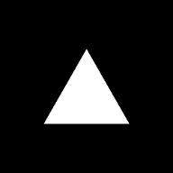

<div style="display:flex;flex-direction:column;align-items:center;">
  
  <h1>Next starter</h1>
  <p>This is my personal configuration of a Next.js project.</p>
</div><br><br>

## Installation

You need Node.js 12 or newer, prefer use `yarn` package manager.

1. Clone the repo with custom folder name

```bash
git clone https://github.com/luisresendiz734/next-starter.git <folder_name>
```

2. Enter in the project folder and install all dependencies

```bash
cd  <folder_name>
yarn
```

3. Run app

```bash
yarn dev
```

Enjoy!

## Usage

None

## Contributing

Pull requests are welcome. For major changes, please open an issue first to discuss what you would like to change.

Please make sure to update tests as appropriate.

## License

[MIT](https://choosealicense.com/licenses/mit/)
